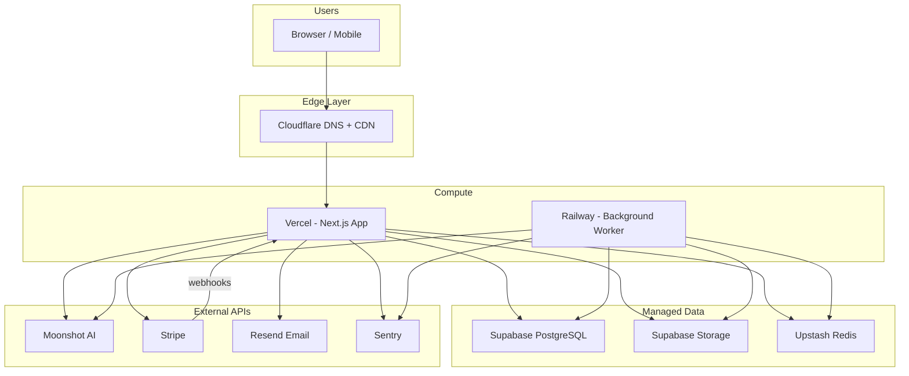
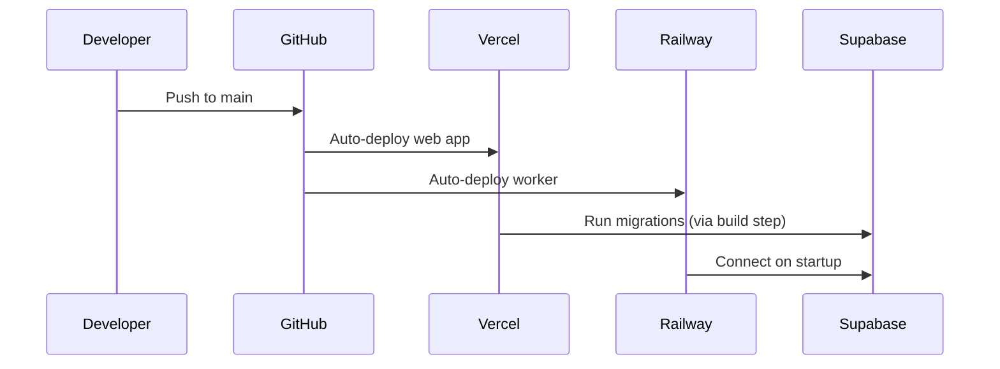

# Deployment & Hosting Architecture

Production hosting for Erasmus AI Assistant uses a **multi-service cloud layout** optimized for Next.js, EU data residency, and background job processing.

## Architecture Overview



## Service Breakdown

| Service | Provider | Role | Why |
|---------|----------|------|-----|
| **Web app + API** | [Vercel](https://vercel.com) | Hosts Next.js (SSR, API routes, SSE chat streaming) | Native Next.js support, auto HTTPS, Git deploys, edge CDN |
| **Background worker** | [Railway](https://railway.app) | BullMQ job processor (agents, PDF/DOCX export, cron) | Vercel has function timeout limits; workers need long-running processes |
| **Database** | [Supabase](https://supabase.com) | PostgreSQL (users, projects, tokens, billing) | Managed Postgres, backups, connection pooling, EU region |
| **File storage** | Supabase Storage | Generated documents (PDF, DOCX, MD) | S3-compatible, same provider as DB |
| **Job queue + cache** | [Upstash](https://upstash.com) | Redis for BullMQ + rate limiting | Serverless-friendly Redis, pay-per-request |
| **Payments** | [Stripe](https://stripe.com) | Subscriptions, Checkout, webhooks | Industry standard recurring billing |
| **Email** | [Resend](https://resend.com) | Verification, password reset, receipts | Simple API, good deliverability |
| **DNS + CDN** | [Cloudflare](https://cloudflare.com) | Custom domain, DDoS protection, caching | Free tier, fast global DNS |
| **Monitoring** | [Sentry](https://sentry.io) | Error tracking, performance | Real-time alerts for production issues |

## Why Two Compute Services?

Vercel is ideal for the Next.js web layer but **cannot run persistent background workers**:

- Serverless function timeouts: 10s (Hobby), 60s (Pro), 300s (Enterprise)
- AI agent runs and PDF generation (Puppeteer) can exceed these limits
- BullMQ requires a always-on Node.js process to consume jobs

**Split:**

| Runs on Vercel | Runs on Railway Worker |
|----------------|------------------------|
| Page rendering, auth, CRUD APIs | Agent processing (Compliance, Budget, etc.) |
| Chat SSE streaming (within timeout) | Document export (DOCX, PDF) |
| Stripe webhook handler | Monthly token reset cron |
| File upload initiation | Stripe webhook retry queue |

## EU Data Residency

Erasmus+ is an EU programme. Prefer **EU regions** for data storage:

| Service | Recommended Region |
|---------|-------------------|
| Supabase Postgres | `eu-central-1` (Frankfurt) |
| Supabase Storage | Same project (Frankfurt) |
| Vercel Functions | `fra1` (Frankfurt) |
| Upstash Redis | `eu-central-1` |
| Railway Worker | `eu-west` (Amsterdam or Frankfurt) |

Configure in each provider's dashboard when creating resources.

## Environments

| Environment | Purpose | URL pattern |
|-------------|---------|-------------|
| **Local** | Development | `http://localhost:3000` |
| **Preview** | PR previews (auto) | `*.vercel.app` |
| **Staging** | Pre-production testing | `staging.erazmus.ai` |
| **Production** | Live users | `app.erazmus.ai` |

Each environment gets its own:
- Supabase project (or separate schemas)
- Stripe mode (test vs live keys)
- Upstash Redis database
- Railway worker service

## Deployment Flow



### Vercel (Web App)

1. Connect GitHub repo to Vercel
2. Set root directory to `/` (monorepo root)
3. Framework preset: Next.js
4. Add all env vars from `.env.example`
5. Set function region to `fra1`
6. Add build command: `prisma generate && prisma migrate deploy && next build`

### Railway (Worker)

1. Create new service from same GitHub repo
2. Use `Dockerfile.worker` (or `railway.toml` start command)
3. Set `WORKER_MODE=true` env var
4. Share same `DATABASE_URL`, `REDIS_URL`, `MOONSHOT_API_KEY` as Vercel
5. No public HTTP needed (internal job consumer only)

### Supabase

1. Create project in Frankfurt
2. Copy connection string → `DATABASE_URL`
3. Enable connection pooling (port 6543) for serverless
4. Create storage bucket: `documents` (private, RLS policies)
5. Copy `SUPABASE_URL` + `SUPABASE_SERVICE_KEY`

### Stripe

1. Create products: Basic ($19/mo), Pro ($49/mo)
2. Copy price IDs → `STRIPE_PRICE_BASIC`, `STRIPE_PRICE_PRO`
3. Configure webhook endpoint: `https://app.erazmus.ai/api/billing/webhook`
4. Events: `checkout.session.completed`, `invoice.paid`, `invoice.payment_failed`, `customer.subscription.updated`, `customer.subscription.deleted`

### Cloudflare (Domain)

1. Add domain `erazmus.ai`
2. CNAME `app` → `cname.vercel-dns.com`
3. Enable proxy (orange cloud) for DDoS protection
4. SSL mode: Full (strict)

## Estimated Monthly Cost (MVP Scale)

Assumes ~100–500 active users, low-moderate AI usage.

| Service | Tier | Est. Cost |
|---------|------|-----------|
| Vercel | Pro | $20/mo |
| Supabase | Pro | $25/mo |
| Railway | Starter | $5–20/mo |
| Upstash Redis | Pay-as-you-go | $0–10/mo |
| Resend | Free → Pro | $0–20/mo |
| Sentry | Developer | $0–26/mo |
| Cloudflare | Free | $0 |
| Stripe | Per transaction | 2.9% + $0.30 |
| Moonshot AI | API usage | Variable |
| Domain | Annual | ~$12/yr |

**Total fixed infra: ~$50–100/mo** before AI API and Stripe fees.

## Scaling Path

| Stage | Trigger | Action |
|-------|---------|--------|
| MVP launch | First 100 users | Current stack is sufficient |
| Growth | 1,000+ users, slow PDF gen | Scale Railway worker replicas |
| High traffic | Chat latency issues | Vercel Enterprise or dedicated Node server |
| Cost optimization | $500+/mo infra | Migrate worker to Hetzner VPS (Docker) |
| Enterprise | Team features | Add separate collaboration service |

## Alternative: Full Self-Hosted (Hetzner)

For maximum control and lower cost at scale:

```
Hetzner CPX31 VPS (€15/mo, EU)
├── Docker Compose
│   ├── next-app (Node)
│   ├── worker (Node + Chromium)
│   ├── postgres
│   └── redis
├── Caddy (auto HTTPS reverse proxy)
└── Cloudflare DNS
```

**Pros:** Lower cost at scale, full control, no cold starts  
**Cons:** You manage updates, backups, monitoring, SSL  
**Recommendation:** Use managed stack for MVP; migrate to Hetzner if monthly infra exceeds ~$200.

## Security Checklist (Production)

- [ ] All secrets in provider env vars (never in code)
- [ ] Supabase RLS enabled on storage bucket
- [ ] Stripe webhook signature verification
- [ ] HTTPS enforced (Vercel + Cloudflare)
- [ ] Database connection via pooling (not direct 5432 from Vercel)
- [ ] Rate limiting on auth and AI endpoints
- [ ] Sentry alerts configured for error spikes
- [ ] Database backups enabled (Supabase daily)
- [ ] Separate Stripe test/live keys per environment

## Local Development

```bash
# Start local Postgres + Redis
docker compose up -d

# Copy env template
cp .env.example .env

# Run migrations
npx prisma migrate dev

# Start web app
npm run dev

# Start worker (separate terminal)
npm run worker:dev
```

Local services map to production equivalents:

| Local | Production |
|-------|------------|
| Docker Postgres :5432 | Supabase PostgreSQL |
| Docker Redis :6379 | Upstash Redis |
| `localhost:3000` | Vercel |
| `npm run worker:dev` | Railway worker |
